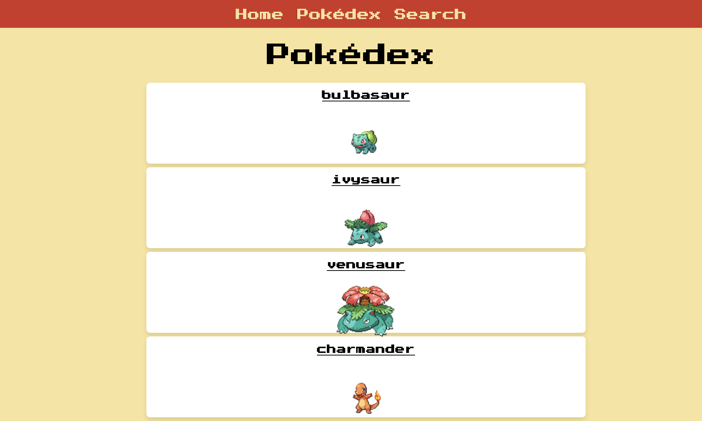

# Pokémon React Project

An interactive React application that allows users to explore the world of Pokémon, view detailed information, and navigate through different Pokémon. 

### Technologies & Tools
	•	React for front-end development
	•	CSS / HTML for styling
	•	Fetch API to retrieve Pokémon data
	•	Optional libraries: axios, react-router, etc.

### Installation & Running Locally
1. Clone the repository:
<pre>
git clone https://github.com/rosros98/pokemon_react_project.git
cd pokemon_react_project
</pre>
2. Install dependencies:
<pre>
npm install
</pre>
3. Start the development server:
<pre>
npm start
</pre>
4. Open your browser at http://localhost:3000 --> The app will auto-reload when you edit files.

### Main Features 
	•	View a complete list of Pokémon
	•	Detailed view for each Pokémon (type, abilities, stats)
	•	Simple navigation between Pokémon

## Available Scripts

In the project directory, you can run:

### `npm start`

Runs the app in the development mode.\
Open [http://localhost:3000](http://localhost:3000) to view it in your browser.

The page will reload when you make changes.\
You may also see any lint errors in the console.

### `npm test`

Launches the test runner in the interactive watch mode.

## Preview

  

